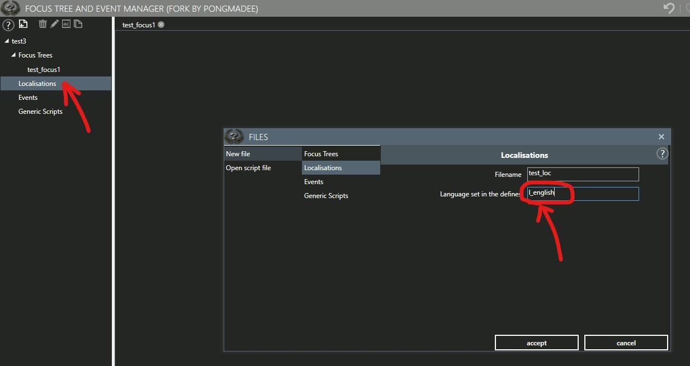
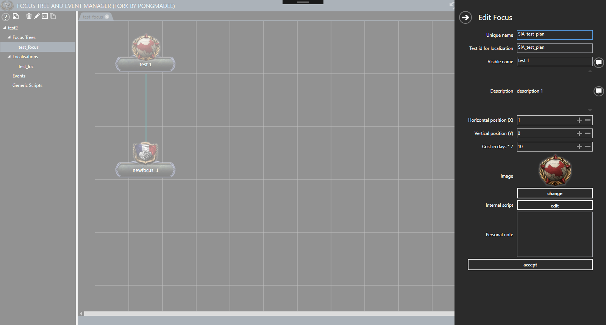
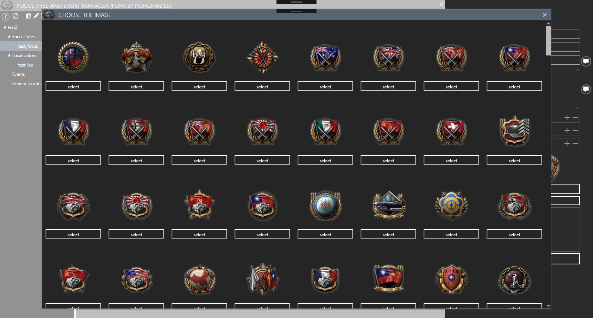
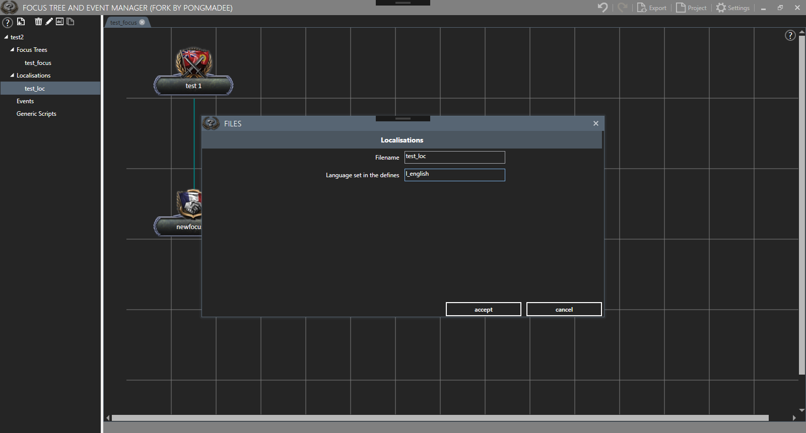
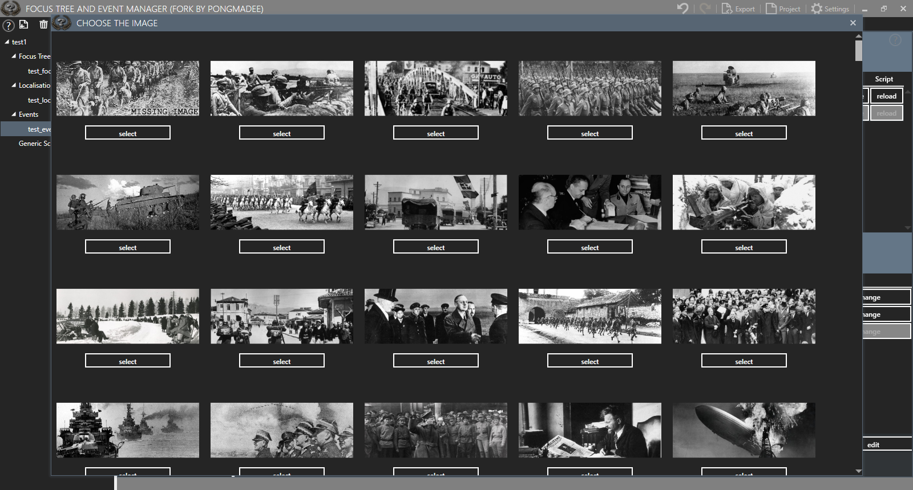
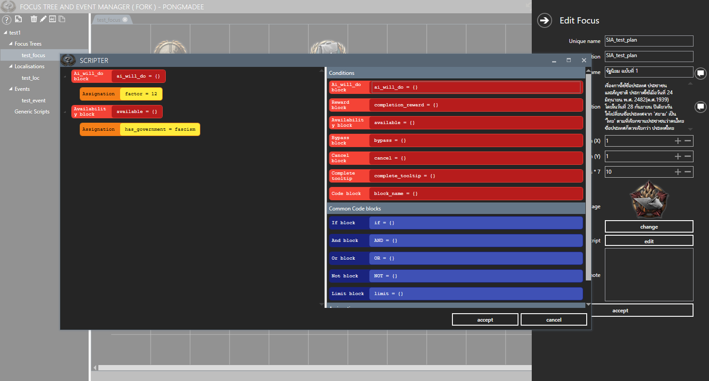

</>

# FocusTreeAndEventManager
Focus tree and Event manager for Heart of Iron IV

## Beta_3c_fix1
#### [Download the lastest release](https://github.com/pongmadee/FocusTreeAndEventManager/releases)

## Fixed and change information
- Fixed localization files save in UTF-8 with BOM format
- Fixed event files save in UTF-8 with BOM format
- Fixed localization export file name pattern = {name}_{language_set}.yml eg. 'test_l_english.yml'
- Fixed focus image and button, interface layout in Edit focus panel & Select focus icon window
- Fixed AsyncImageLoader load event image
- Fixed update localization text to data grid when modified description script
- Fixed Scripter block incorrect condition title (And / Or )
- Fixed selected event image not display on change image event
- Remember file project path for next open or export project
- Change cost variable type form double to int reference to wiki documents
- Compatible with 1.7.x

### Important :
> When you create a new localization file please set language define to export file name pattern = {name}_{language_set}.yml eg. 'test_l_english.yml'.

      

## Other Tools
- [HOI4-QuickInsertGFX](https://github.com/pongmadee/HOI4-QuickInsertGFX) : This tool was created to work with FocusTreeAndEventManager, help to insert events pictures & goals/focus images file data into the GFX files(eventpictures.gfx , goals.gfx) in the mod's interface directory.
